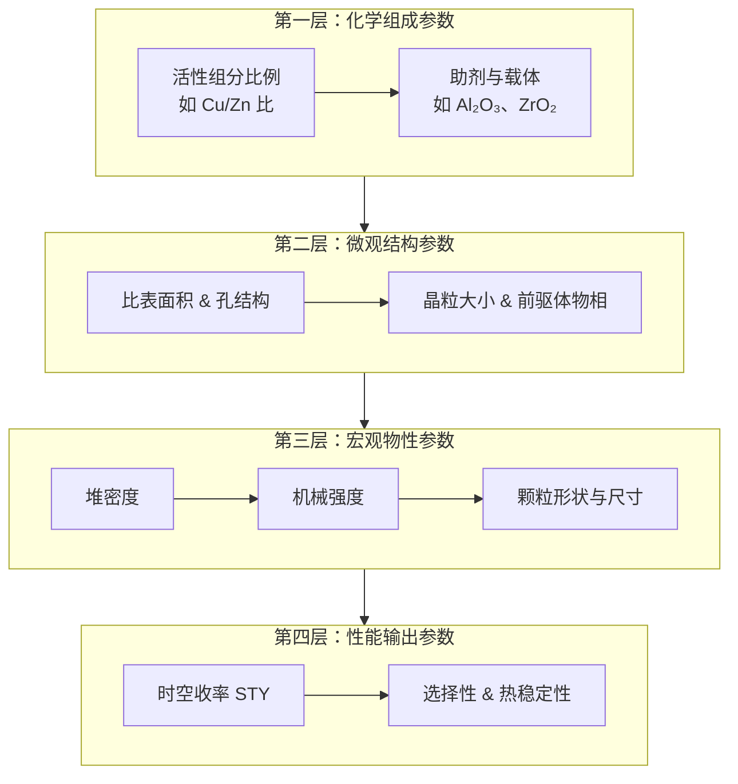

# 铜基催化剂

甲醇的铜基催化剂是合成甲醇工业的核心，目前的主流分类、特点及市场情况如下：

## 🔬 核心分类与特点

铜基催化剂主要通过添加不同的**助剂**来分类，以改善其性能。

*   **Cu-Zn-Al系（铜锌铝）**：**这是目前应用最广、最主流的催化剂**。它由铜、氧化锌和氧化铝组成，在活性、选择性和热稳定性方面取得了很好的平衡，是当代甲醇生产的主力。例如，英国庄信万丰（JM）的ICI系列、丹麦托普索（Topsoe）的MK系列都属于此类。
*   **Cu-Zn系与Cu-Zn-Cr系**：属于早期或特殊用途的催化剂。Cu-Zn系性能相对单一；而Cu-Zn-Cr系是更早的高温高压工艺所用，现在已基本被淘汰。
*   **Cu-Zr系及其他新型催化剂**：为应对特定需求而研发。例如，添加**锆（Zr）**可以提升催化剂的低温活性。随着“绿色甲醇”的发展，以**CuO/ZnO/ZrO₂**为代表的新型催化剂也成为了重要的研发方向。

## 📊 各类优劣势对比

| 催化剂类型 | 优势 | 劣势 |
| :--- | :--- | :--- |
| **Cu-Zn-Al系（主流）** | **综合性能优异**：活性、选择性和热稳定性平衡得很好；技术成熟，是工业化应用的首选。 | 对硫、氯等毒物敏感，需要严格的原料净化。 |
| **新型Cu-Zr系** | **低温活性好**：在较低温度（200-250℃）下就能表现出高活性。 | 技术成熟度相对较低，大规模工业化应用仍在推广阶段。 |
| **其他/早期类型** | 无 | **性能落后或稳定性差**：Cu-Zn-Cr等早期催化剂因寿命短、操作条件苛刻，已基本被淘汰。 |

## 🏭 主流选择与知名制造商

*   **当前市场主流**：**Cu-Zn-Al系催化剂**，特别是**CuO/ZnO/Al₂O₃**配方，凭借其经过长期工业验证的可靠性能，牢牢占据着市场主导地位。
*   **著名制造商**：全球市场由少数几家技术领先的国际巨头主导，前五大厂商占据了超过50%的市场份额。主要参与者包括：
    *   **Johnson Matthey (庄信万丰)**：总部位于英国，拥有ICI系列等经典产品，是历史最悠久、技术积淀最深厚的厂商之一，并已在中国开展业务。
    *   **Topsoe (托普索)**：总部位于丹麦，其MK系列催化剂是市场上的另一主流产品，尤其专注于可再生和低碳领域。
    *   **BASF (巴斯夫)**：总部位于德国，全球化工巨头，也提供先进的甲醇催化剂，如用于绿色甲醇的SYNSPIRE技术。
    *   **Clariant (科莱恩)**：总部位于瑞士，是特种化学品领域的全球领导者，提供高效的铜基和锌基催化剂。
    *   **中国本土力量**：中国作为全球最大的甲醇生产国（占约67%），本土企业实力强劲。代表企业包括**中国催化剂控股有限公司**、**西南化工研究设计院**（其XNC-98型催化剂性能达国际先进水平）、**中石化南化研究院**等。

基于搜索结果，这两类催化剂的操作条件对比如下：

## Cu-Zn-Al系催化剂的操作条件

这是工业应用最成熟、最广泛的一类催化剂，通常用于**低压合成甲醇工艺**，操作窗口较宽。

*   **温度范围**：工业上通常在 **200–360°C** 范围内均有良好活性和选择性。一些新型催化剂在更低的温度下就有很好的表现，例如XNC-98型催化剂，在入塔温度仅需 **190–194°C** 即可达到设计指标。
*   **压力范围**：典型操作压力在 **4.6–10 MPa**。部分专利或研究中也涉及 **3.0–5.0 MPa** 的条件。
*   **优势**：技术高度成熟，综合性能（活性、选择性、寿命）平衡，是当前工业合成甲醇的绝对主流选择。
*   **劣势**：对硫、氯等毒物敏感，对原料气净化要求极高。

## Cu-Zr系催化剂的操作条件

这类催化剂多处于**研发或特定应用推广阶段**，尤其在**CO₂加氢制绿色甲醇**领域备受关注。

*   **温度范围**：报道的温度区间多为 **200–280°C**。部分研究显示在 **250–350°C** 范围内也有应用。某些新型Cu-Zr催化剂在 **200°C** 的低温下甚至能达到 **100%** 的甲醇选择性。
*   **压力范围**：研究中的压力条件跨度较大，从 **1.0 MPa** 到 **5.0 MPa** 不等。例如，有研究在 **4.5 MPa** 条件下取得了很好的CO₂转化率和甲醇选择性，也有在 **2.0 MPa** 条件下进行测试的报道。
*   **优势**：在CO₂加氢制甲醇反应中展现出优异的低温活性、高选择性和良好的热稳定性。尤其是**Cu-ZrO₂界面**被认为对提高甲醇选择性和收率有关键作用。
*   **劣势**：技术成熟度相对较低，大规模工业应用的案例和数据远不如Cu-Zn-Al系丰富，部分催化剂的长期稳定性仍需进一步验证。

## 堆密度为何重要

甲醇合成催化剂之所以“追求”堆密度，是因为它直接关联到工业生产的效率和成本，但这里的“追求”需要从两个层面来理解：

1.  **追求“高”堆密度：为了在有限空间里装更多催化剂**。在工业反应器（体积固定）中，堆密度越高，总装填量就越大，意味着产能上限更高。例如，中煤陕西公司曾通过试用高堆密度催化剂，在固定反应器内实现了有效增产。

2.  **追求“最佳”堆密度：为了平衡活性与传质效率**。催化剂颗粒内部存在内扩散阻力，堆密度太大，气体扩散受阻，影响活性发挥；堆密度太小，单位体积活性中心不足，且强度可能下降。因此存在一个**“最佳堆密度”**，此时活性位点与传质效率达到最优平衡。

### 堆密度如何影响性能？

*   **对活性和效率的影响**：催化剂宏观反应速率受内扩散影响，而内扩散与堆密度、孔隙结构直接相关。堆密度过高，颗粒内部细孔可能被过度压缩，气体分子难以进出，导致活性中心无法充分利用。工业案例显示，优化催化剂堆密度后，系统压降明显降低，转化率提升。

*   **对强度和使用寿命的影响**：堆密度与机械强度正相关。堆密度过低，颗粒易粉化、磨耗高，寿命缩短。有专利技术通过特殊制备方法，在降低堆密度的同时提高强度，同时实现活性提升和寿命延长。

### 工业上的“最佳”区间在哪里？

不同催化剂配方和工艺存在不同的密度区间，以下是两个方向性参考：

*   **固定床典型区间**：多在 **1.25 - 1.6 kg/L**。如XNC-98为1.25 kg/L，Topsoe的MK-121标准装填密度为1.2–1.3 kg/m³ (需注意单位，应为kg/L量级)，JC301为1.4-1.6 kg/L。
*   **学术研究中的“最优”概念**：有研究指出，Cu基催化剂存在对应于堆密度**2.3–2.5 g/cm³ (即2.3–2.5 kg/L)** 的最佳效率因子。虽显著高于工业数据（可能与测试条件、催化剂真实密度定义有关），但指向一个核心结论：**堆密度与催化效率存在明确的“火山型”曲线关系**，而非越高越好。

### 总结

工业实践并非单纯追求“越高越好”或“越低越好”，而是**通过催化剂配方和制备工艺的优化，为特定工艺和反应器寻找那个能使活性、传质、强度和产能综合效益最大化的“最佳堆密度”区间**。

# 如何评价甲醇催化剂

## 四个指标：

这几个指标之所以被视为评价甲醇合成催化剂的关键，是因为它们直接关系到工业生产的经济性、安全性和可靠性。下面我为你逐一拆解：

### 低温低压活性：决定效率与成本的“第一把钥匙”

甲醇合成是强放热且分子数减少的反应，低温高压对其热力学平衡有利。因此，催化剂的低温活性至关重要。

*   **对经济性的影响**：低温活性强的催化剂，意味着反应可以在更温和的条件下（例如温度降低10-15℃）高效进行，这能显著降低能耗和循环气压缩负荷，从而直接节省运营成本。
*   **对化学平衡的贡献**：低温更有利于反应平衡向生成甲醇的方向移动。高活性的催化剂能让你在较低温度下就获得理想的转化率，突破了高温下的平衡限制。

### 热稳定性：决定寿命与可靠性的“生命线”

热稳定性是催化剂能否长期稳定运行的基石。甲醇合成反应本身释放大量热量，若移热不及时，局部过热会导致：

*   **活性组分烧结**：这是最主要的原因。高温会使催化剂中的活性组分（Cu）晶粒长大、比表面积下降，活性随之永久性衰减，这是催化剂失活的最主要原因之一。
*   **催化剂寿命缩短**：热稳定性差的催化剂，其性能会在短时间内快速衰退，导致频繁停车更换，大幅增加成本。
*   **存在“热脆性”风险**：极端情况下，如飞温，可能导致催化剂强度下降，发生“热脆性”粉化，严重时甚至堵塞反应器。

### 制备技术：决定性能上限的“基因”

制备技术看似是过程，实则是决定催化剂最终性能上限的根本。它决定了催化剂的“遗传基因”：

*   **微观结构可控性**：沉淀、洗涤、干燥、焙烧等步骤，决定了催化剂的**晶粒大小、比表面积、孔径分布及活性组分的分散度**。这些微观特征直接决定了宏观的活性和选择性。
*   **活性位点构筑**：制备过程，特别是含锆（Zr）催化剂的制备，直接影响了**Cu⁰和Cu⁺活性位点的比例与协同作用**，这决定了催化反应路径的效率。
*   **提高生产效率**：例如，采用新型制备技术可使催化剂的时空收率提升30%以上，直接提升工厂产能。

### 抗毒性：保护催化剂免受“慢性伤害”

工业原料气中常含有微量的毒物，它们会“毒化”催化剂，导致失活。抗毒性越强，催化剂的“耐受性”就越好。

*   **硫化物是“头号杀手”**：H₂S和有机硫是**不可逆毒物**，会与活性金属铜生成稳定的CuS，导致活性位点永久性丧失。
*   **氯化物和重金属**：同样会不可逆地吸附在活性位点上，导致活性下降，是催化剂失活的另一类重要因素。

### 总结：四大指标的协同关系

总而言之，这四个指标并非孤立，而是相互关联、共同决定了催化剂的工业实用价值。

> *   **低温低压活性**是催化剂“能力强”的体现。
> *   **热稳定性**是“活得久”的保障。
> *   **制备技术**是“出身好”的基础。
> *   **抗毒性**是“抗干扰”的护身符。

**一个理想的工业催化剂，必须在“能力强”、“活得久”、“出身好”和“抗干扰”这四个方面都表现优异，才能带来最大的经济回报。**

## 甲醇催化剂设计四层体系

甲醇合成催化剂各设计参数的详细意义及工业实践中的典型取值。

---

### 四层体系：从分子设计到工业应用

---

### 第一层：化学组成参数（基因层）

### 1.1 活性组分比例（Cu/Zn 摩尔比）

**意义：** 这是最核心的设计参数，直接决定了活性位点的数量与分布。铜是主活性组分（还原后形成Cu⁰和Cu⁺），锌作为助剂起到分散铜晶粒和提供结构稳定性的作用。研究表明，Cu/Zn比可通过影响催化剂前驱体结构来改变催化活性。

**工业实践取值：**
| 催化剂/工艺 | Cu/Zn 摩尔比 | 说明 |
|:---|:---|:---|
| **常规工业铜基催化剂** | **3:1 ~ 2:1** | 工业上普遍采用的范围，能较好平衡活性与热稳定性 |
| **MC17商业催化剂** | 3:1 ~ 2:1 | CO转化率达67.2%，模拟失活后活性保留率>86% |
| **专利配方示例** | 2.0 ~ 3.0 | 某含TiO₂催化剂专利中给出的范围 |

**设计逻辑：** Cu含量过低则活性不足，过高则铜晶粒易烧结导致热稳定性下降。

### 1.2 助剂与载体组成

**意义：** Al₂O₃是最常用载体，起分散活性组分和提供结构支撑的作用。引入ZrO₂、TiO₂、CeO₂等助剂可针对性优化性能——Zr可增强耐水性，Ti可改善低温活性，Ce可提高碳转化率。

**工业实践取值：**
| 组分 | 典型质量分数 | 作用 |
|:---|:---|:---|
| **CuO** | 36–70% | 活性组分（还原后为Cu） |
| **ZnO** | 19–43% | 助剂，分散铜、提供结构稳定性 |
| **Al₂O₃** | 4–15% | 载体，增大比表面积、防止烧结 |
| **TiO₂/ZrO₂** | 1–10% | 助剂，改善低温活性或耐水性 |

---

### 第二层：微观结构参数（形态层）

### 2.1 比表面积（BET）

**意义：** 高比表面积有利于活性组分的分散，提供更多的活性位点。但比表面积过高可能导致孔道过细，影响内扩散效率。

**工业实践取值：**
| 参数 | 典型值 |
|:---|:---|
| **工业催化剂比表面积** | 70–90 m²/g |
| **甲醇制氢催化剂（参考）** | 50–60 m²/g |

### 2.2 孔径与孔隙率

**意义：** 孔径决定反应物分子能否有效进入催化剂内部到达活性位点，孔隙率影响内扩散效率和整体活性位点密度。

**设计指引（来自模拟研究）：**
| 参数 | 优化建议 | 依据 |
|:---|:---|:---|
| **孔径** | ~50 nm | 此孔径下CO₂转化率和甲醇选择性均较高 |
| **孔隙率** | ~0.4 | 同上，平衡扩散与活性位点密度 |

### 2.3 前驱体物相

**意义：** 催化剂前驱体的晶型（如锌孔雀石结构）直接影响还原后活性铜的分散度。沉淀温度、pH值、陈化时间等因素均会影响前驱体结构。

---

### 第三层：宏观物性参数（工程层）

### 3.1 堆密度

**意义：** 决定单位反应器体积的催化剂装填量，直接影响产能和经济性。堆密度过低则装填量不足，过高则可能影响气体扩散。

**工业实践取值：**
| 催化剂 | 堆密度 | 来源 |
|:---|:---|:---|
| **RK-05催化剂** | 1.3–1.4 g/mL | 国内成熟产品 |
| **C207/NC305催化剂** | 1.4–1.6 kg/L | 工业招标指标 |
| **甲醇制氢催化剂** | 1.2–1.3 g/mL | 不同工艺参考 |

### 3.2 机械强度

**意义：** 催化剂需承受气流冲击和床层压力。强度不足会导致粉化、磨耗增加、床层压降升高。

**工业实践取值：**
| 指标 | 典型值 |
|:---|:---|
| **径向抗压碎力** | ≥180–200 N/cm |
| **低强度颗粒比例（<90 N/cm）** | ≤5% |

### 3.3 颗粒形状与尺寸

**意义：** 影响床层压降和传质效率。工业上通常采用圆柱体或三叶草形，以平衡压降和传质。

**工业实践取值：**
| 参数 | 典型值 |
|:---|:---|
| **外形尺寸** | Φ5 × (4–6) mm |
| **粒径优化** | ~8 mm（可在保持性能的同时降低压降） |

---

## 第四层：性能输出参数（综合层）

### 4.1 时空收率（STY）

**意义：** 综合反映单位体积（或质量）催化剂在单位时间内的产甲醇能力，是活性、选择性、装填密度、操作条件的综合输出指标，直接决定反应器产能和投资成本。

**工业实践取值：**
| 催化剂/条件 | 时空收率 | 说明 |
|:---|:---|:---|
| **RK-05催化剂（耐热前）** | 1.82 g/(mL·h) | 工业成熟产品 |
| **RK-05催化剂（耐热后）** | 1.52 g/(mL·h) | 体现热稳定性影响 |
| **某30万吨/年装置** | 1.07 t/(m³·h) | 工业运行数据 |

### 4.2 选择性

**意义：** 甲醇选择性决定副产物（烃类、二甲醚等）的生成量，影响产品纯度和原料利用率。

**工业实践：** 铜基催化剂在优化条件下甲醇选择性通常>95%。副反应如逆水煤气变换（CO₂→CO）在高温下加剧，需控制操作温度。

### 4.3 热稳定性（耐热后活性保留率）

**意义：** 反映催化剂在高温条件下的抗烧结能力，决定催化剂使用寿命。工业上通常以“耐热后活性”或“活性保留率”来表征。

**工业实践取值：**
| 指标 | 典型值 |
|:---|:---|
| **耐热后活性保留率** | ≥86% |
| **初活性CO转化率** | ≥81% |
| **耐热后CO转化率** | ≥63% |

---

### 第五层：操作与约束参数（单独列出的原因）

空速和温度/压力虽然不属于“催化剂本征参数”，但它们是催化剂设计时必须匹配的边界条件。

### 空速（GHSV）

**意义：** 决定反应物在催化剂床层的停留时间，是连接催化剂设计与反应器工程的桥梁。

**工业实践取值：**
| 场景 | 空速范围 |
|:---|:---|
| **常规工业甲醇合成** | 5,000–10,000 h⁻¹ |
| **宽范围工业操作** | 6,000–20,000 h⁻¹ |
| **实验室评价** | 9,600–12,000 h⁻¹ |

### 温度与压力

**意义：** 甲醇合成是放热、体积缩小的反应，温度压力直接影响化学平衡和反应速率。

**工业实践取值：**
| 参数 | 范围 |
|:---|:---|
| **操作温度** | 220–255°C（初期控下限，后期逐步提高） |
| **操作压力** | 5–10 MPa（常规低压法）；部分老工艺可达22 MPa |

---

### 四层体系的完整对应表

| 层级 | 参数 | 工业典型值 | 影响维度 |
|:---|:---|:---|:---|
| **第一层** | Cu/Zn比 | 2:1 ~ 3:1 | 活性与热稳定性的根本来源 |
| | CuO含量 | 36–70% | 活性组分总量 |
| | Al₂O₃含量 | 4–15% | 结构稳定与分散 |
| | 助剂（Zr/Ti/Ce） | 1–10% | 耐水性/低温活性/选择性 |
| **第二层** | 比表面积 | 70–90 m²/g | 活性位点可及性 |
| | 孔径 | ~50 nm | 内扩散效率 |
| | 孔隙率 | ~0.4 | 扩散与活性位点密度平衡 |
| **第三层** | 堆密度 | 1.3–1.6 kg/L | 装填量与产能 |
| | 抗压强度 | ≥180 N/cm | 寿命与运行可靠性 |
| | 粒径 | Φ5×(4–6) mm | 压降与传质 |
| **第四层** | 时空收率 | 1.07–1.82 g/(mL·h) | 综合产出能力 |
| | 耐热后活性保留 | ≥86% | 热稳定性 |
| **操作层** | 空速 | 5,000–20,000 h⁻¹ | 停留时间/产能 |
| | 温度 | 220–255°C | 平衡与速率 |
| | 压力 | 5–10 MPa | 平衡与设备投资 |

这套参数体系构成了工业催化剂“设计-制备-评价-放大”的完整闭环。每一层的参数都需要在特定工艺条件下进行优化匹配，才能实现最佳的综合经济效益。

# CO是怎么反应生成甲醇的？

## 一、总反应

CO 加氢合成甲醇的总反应方程式为：

> **CO + 2H₂ ⇌ CH₃OH**  
> ΔH₂₉₈ = **-90.7 kJ/mol**（强放热反应）

### 反应特点

| 特征 | 说明 |
|:---|:---|
| **体积缩小** | 3 mol 气体 → 1 mol 气体，**高压有利** |
| **放热反应** | **低温有利**，但温度过低反应速率太慢 |
| **工业操作条件** | 温度 200–260°C，压力 5–10 MPa |
| **工业氢碳比** | H₂/CO ≈ 2.0–2.2（略高于化学计量比） |

这就是为什么工业甲醇合成采用**低压法**（5–10 MPa）而非传统高压法（30 MPa）——催化剂活性的提升使得在较低压力下仍能获得可接受的产率，同时显著降低了设备投资和运行成本。

---

## 二、反应机理

### 2.1 活性位点

铜基催化剂上存在两种关键活性位点，分工明确：

| 活性位点 | 功能 |
|:---|:---|
| **Cu⁰**（金属铜） | 负责 **H₂ 的解离活化**：H₂ → 2H* |
| **Cu⁺**（部分氧化铜）或 Cu⁺/Cu⁰ 界面 | 负责 **CO 的吸附与活化**，使 CO 分子中的 C=O 键得以削弱 |

这两种位点的**协同作用**是催化剂活性的核心。Cu⁺位点吸附 CO，Cu⁰位点提供活性氢原子，两者缺一不可。

### 2.2 CO 加氢的两条主要路径

关于 CO 如何在铜基催化剂上转化为甲醇，学术界公认存在两条路径，且它们**同时在催化剂表面发生**，只是在不同条件下贡献比例不同。

---

#### 路径一：甲酸盐路径（Formate Path）—— CO 的“间接路线”

这条路径中，CO **不直接**参与加氢，而是**先通过水煤气变换（WGS）反应变成 CO₂**，再由 CO₂ 走甲酸盐路径生成甲醇。

**步骤分解：**

| 步骤 | 反应 | 说明 |
|:---|:---|:---|
| ① WGS 反应 | CO + H₂O → **CO₂** + H₂ | CO 先被氧化成 CO₂（水来自原料气或副产） |
| ② CO₂ 吸附活化 | CO₂ + * → CO₂* | CO₂ 吸附在催化剂表面活性位点 |
| ③ 甲酸盐形成 | CO₂* + H* → **HCOO*** | 这是 CO₂→甲醇路径中公认的**速率决定步骤** |
| ④ 逐步加氢 | HCOO* → H₂COO* → CH₃O* | 甲酸盐经二氧亚甲基、甲氧基逐步加氢 |
| ⑤ 甲醇脱附 | CH₃O* + H* → **CH₃OH** + * | 甲醇生成并脱附，活性位点再生 |

**总效果**：CO → CO₂ → HCOO* → CH₃OH

> ⚠️ **关键澄清**：这条路径中，**HCOO*（甲酸盐）是 CO₂ 加氢的中间体**，不是 CO 加氢的中间体。CO 本身**不直接**生成甲酸盐；它需要先变成 CO₂。

**证据**：
- **原位红外光谱（in situ FTIR）** 在反应条件下检测到甲酸盐（HCOO*）的特征吸收峰
- **同位素标记实验**（¹³CO + ¹²CO₂）证实，甲醇中的碳部分来自 CO₂
- 当原料气中完全没有 CO₂ 时，甲醇产率显著下降（说明 WGS 提供的 CO₂ 不足时，反应速率受限）

---

#### 路径二：直接加氢路径（Formyl Path）—— CO 的“直接路线”

这是 CO **不经过 CO₂** 直接加氢生成甲醇的路径。

**步骤分解：**

| 步骤 | 反应 | 说明 |
|:---|:---|:---|
| ① CO 吸附 | CO + * → CO* | CO 吸附在 Cu⁺ 位点 |
| ② 甲酰基形成 | CO* + H* → **HCO*** | 甲酰基（formyl），这一步**活化能较高** |
| ③ 逐步加氢 | HCO* → H₂CO* → H₃CO* | 甲醛 → 甲氧基 |
| ④ 甲醇脱附 | H₃CO* + H* → **CH₃OH** + * | 甲醇生成并脱附 |

**总效果**：CO → HCO* → H₂CO* → H₃CO* → CH₃OH

> ⚠️ **关键限制**：这一步 CO* + H* → HCO* 的**活化能垒较高**，是整条路径的**速率决定步骤**。这也是为什么 CO 的直接加氢路径在工业条件下的贡献相对较小。

---

### 2.3 两条路径的对比总结

| 对比维度 | 路径一：甲酸盐路径（间接） | 路径二：直接加氢路径 |
|:---|:---|:---|
| **起点** | CO → CO₂（先经 WGS） | **CO 直接** |
| **关键中间体** | 甲酸盐（HCOO*） | 甲酰基（HCO*） |
| **CO₂ 的作用** | **必需中间体**（CO 必须先变成 CO₂） | **不参与** |
| **速率决定步骤** | CO₂ + H* → HCOO* | CO* + H* → HCO* |
| **活化能垒** | 相对较低 | **较高**（H-CO 键形成困难） |
| **工业贡献** | **较大**（CO₂ 路径更顺畅） | 较小（受限于高能垒） |

---

## 三、与 CO₂ 加氢的对比

| 对比维度 | CO 加氢 | CO₂ 加氢 |
|:---|:---|:---|
| **总反应** | CO + 2H₂ → CH₃OH | CO₂ + 3H₂ → CH₃OH + H₂O |
| **反应热 (ΔH)** | -90.7 kJ/mol（放热更强） | -49.5 kJ/mol（放热较弱） |
| **副反应** | 较少（CO → 烃类等） | 易发生 RWGS（CO₂ + H₂ → CO + H₂O） |
| **水的影响** | 无 H₂O 生成（直接路径） | 有 H₂O 生成，可能影响活性位点 |
| **工业成熟度** | **极高**（传统合成气工艺） | 新兴领域（绿色甲醇） |
| **典型催化剂** | Cu-Zn-Al（工业标准） | Cu-Zr 系、Cu-Zn-Al-Zr（研发热点） |

---

## 四、工业上的综合考虑

### 4.1 工业合成气的真实组成

工业合成气**不是纯 CO + H₂**，而是**CO、CO₂、H₂ 的混合物**。三种成分在反应中**同时转化**，协同实现甲醇生产：

| 组分 | 来源 | 作用 |
|:---|:---|:---|
| **CO** | 煤/天然气气化 | 主原料，通过两条路径转化为甲醇 |
| **CO₂** | 原料气自带 + WGS 副产 | 自产甲醇（路径一），同时通过 WGS 提供额外 H₂ |
| **H₂** | 气化/重整 + WGS 补充 | 加氢原料，过量 H₂ 有利于平衡和抑制副反应 |

### 4.2 工业操作条件

| 参数 | 典型值 | 说明 |
|:---|:---|:---|
| **温度** | 200–260°C | 低温有利于平衡，但需要足够反应速率 |
| **压力** | 5–10 MPa | 高压有利于体积缩小的反应 |
| **H₂/CO 比** | 2.0–2.2 | 略高于化学计量比，提高 CO 转化率 |
| **CO₂ 含量** | 2–5% | 适量 CO₂ 可提高甲醇产率（提供额外路径） |
| **空速** | 5,000–15,000 h⁻¹ | 取决于催化剂活性和工厂设计 |

### 4.3 关于“CO₂ 是否必需”的工业事实

- **纯 CO + H₂** 也能合成甲醇，但产率较低（仅靠直接加氢路径，受限于 HCO* 形成的高能垒）。
- **工业上都添加少量 CO₂**（2–5%），因为：
  1. CO₂ 本身转化为甲醇
  2. CO₂ 通过 WGS 提供额外 H₂
  3. CO₂ 路径（甲酸盐路径）的活化能垒较低，**与 CO 直接路径形成协同**
  4. 适量 CO₂ 有助于抑制积碳

### 4.4 工业主流催化剂

| 制造商 | 催化剂系列 | 特点 |
|:---|:---|:---|
| **Johnson Matthey（英国）** | Katalco 系列 | 工业标准，Cu-Zn-Al 系 |
| **Topsoe（丹麦）** | MK 系列 | 高活性、长寿命 |
| **BASF（德国）** | SYNSPIRE 系列 | 尤其适用于绿色甲醇 |
| **Clariant（瑞士）** | MegaMax 系列 | 高选择性和稳定性 |
| **西南化工研究设计院（中国）** | XNC-98 系列 | 性能达国际先进水平 |

---

## 五、最终结论

1. **CO 合成甲醇的总反应**是 CO + 2H₂ → CH₃OH（放热、体积缩小）。

2. **反应机理有两条路径**：
   - **甲酸盐路径（间接）**：CO → CO₂（WGS）→ HCOO* → CH₃OH，CO₂ 是必要的中间体
   - **直接加氢路径（直接）**：CO → HCO* → H₂CO* → H₃CO* → CH₃OH，CO₂ 不参与

3. **工业上两条路径同时存在**，但甲酸盐路径因活化能垒较低而贡献更大，直接路径受限于 HCO* 形成的高能垒。

4. **工业合成气中 CO₂ 不是“杂质”而是“重要组分”**，它提供了一条能垒更低的反应通道，与 CO 直接路径形成协同。

5. **铜基催化剂仍是工业标准**，以 Cu-Zn-Al 系为主流，操作温度 200–260°C、压力 5–10 MPa。

